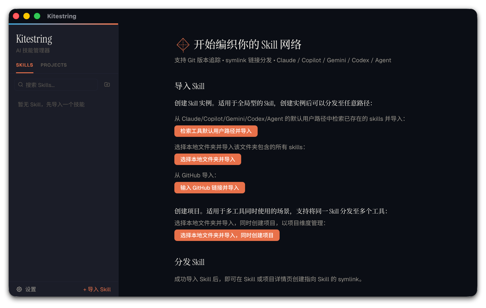
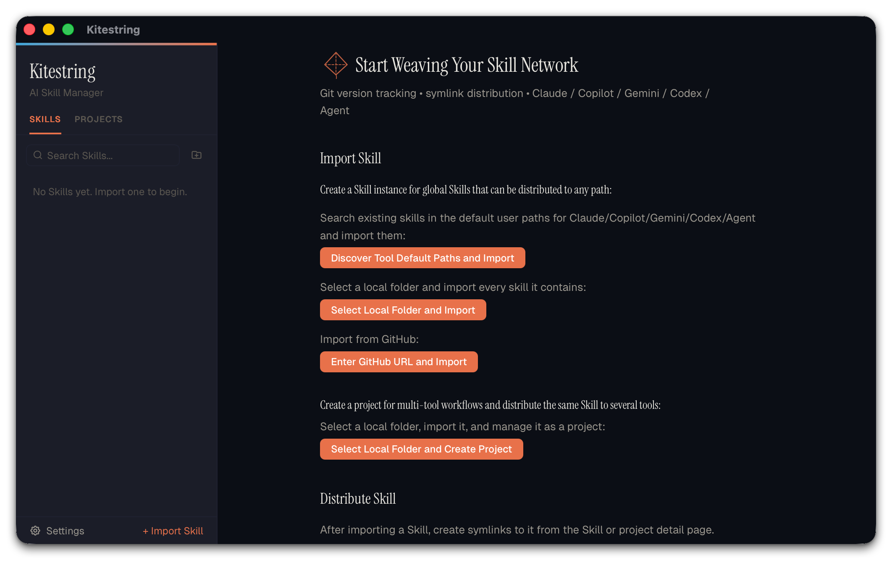

# Kitestring

[English](#english) | 中文

AI 技能（Skill）管理与分发工具。从本地文件夹或 GitHub 仓库导入 Skill，通过符号链接一键分发到 Claude Code、Copilot CLI、Gemini CLI、Codex 等 AI 工具。

[](https://github.com/balabalabalading/Kitestring/releases/tag/v0.1.2)

> **v0.1.2 Early Preview**：Kitestring 已达到可用 MVP 状态，但仍处于早期预览阶段。配置格式、交互细节和工具兼容范围可能在后续版本中调整。

## 界面预览



## 功能特性

- **导入 Skill**：支持本地文件夹导入，以及从 GitHub 仓库克隆导入。
- **智能解析**：自动识别 `SKILL.md` 中的名称和描述，支持常见 front matter 写法。
- **一键分发**：通过 symlink 将 Skill 分发到 AI 工具的全局或项目级读取路径。
- **项目扫描**：检测项目内 `.claude/skills/`、`.codex/skills/` 等工具目录，并建立分发记录。
- **状态监控**：显示各工具的链接状态（已链接 / 断开 / 未分发）。
- **Skill 管理**：浏览文件结构、查看文件内容、分组管理、删除 Skill 及分发记录。
- **Git 集成**：检测 Git 来源信息，并支持对 Git 仓库 Skill 拉取更新。
- **环境诊断**：检查配置、工具路径、Skill 来源与分发链接，并提供可操作的排障建议。
- **应用内更新**：从 v0.1.2 起支持启动静默检查、手动检查、签名验证安装，以及更新后展示版本新内容。
- **双语界面**：内置中文和英文界面文本。

## 支持的工具

| 工具 | 全局路径 | 项目路径 |
|------|---------|---------|
| Claude Code | `~/.claude/skills/` | `.claude/skills/` |
| Copilot CLI | `~/.copilot/skills/` | `.copilot/skills/` |
| Gemini CLI | `~/.gemini/skills/` | `.gemini/skills/` |
| Codex | `~/.codex/skills/` | `.codex/skills/` |
| Agent Folder | 用户自定义 | 用户自定义 |

## 安装

### 下载预构建版本

前往 [Releases](https://github.com/balabalabalading/Kitestring/releases) 下载 `v0.1.2`。

`v0.1.2` 提供 macOS、Windows 和 Linux 预构建安装包。Windows 10+ 需要系统已安装 WebView2。

> `v0.1.2` 是应用内更新的引导版本。已安装 `v0.1.1` 的用户仍需从 Releases 手动下载安装一次；从后续版本开始可在客户端内检查并安装更新。Linux 自动安装仅适用于 AppImage，DEB/RPM 用户会跳转到 Releases 下载对应安装包。

### 从源码构建

环境要求：

- [Rust](https://rustup.rs/) stable
- [Node.js](https://nodejs.org/) 18+
- [pnpm](https://pnpm.io/)
- macOS 12+；Windows 10+ 需要 WebView2

```bash
git clone https://github.com/balabalabalading/Kitestring.git
cd Kitestring
pnpm install
pnpm tauri build
```

## 快速开始

1. 启动 Kitestring。
2. 点击左下角 **「+ 导入 Skill」**。
3. 选择本地文件夹，或输入 GitHub 仓库地址。
4. 在详情面板中选择目标工具，将 Skill 分发到全局或项目路径。

## 配置与数据

Kitestring 使用单一 JSON 配置文件保存本地状态：

```text
~/.kitestring/config.json
```

配置中包含 Skill 列表、分发记录、项目、工具路径和分组信息。Early Preview 阶段暂不承诺配置格式稳定；升级前建议备份该文件。

## 排障

如果遇到导入、分发、路径权限或 GitHub 拉取问题，请先查看 [排障指南](./docs/troubleshooting.md)。

## 已知限制

- v0.1.2 提供 macOS、Windows 和 Linux 预构建安装包；Windows 10+ 需要 WebView2。
- v0.1.1 本身不包含 updater，升级到 v0.1.2 需要手动下载安装。
- Git 拉取仅支持可 fast-forward 的仓库；存在未提交改动、未跟踪文件或分支分叉时会拒绝拉取。
- `SKILL.md` front matter 使用轻量解析器，不是完整 YAML 解析器。
- 当前不包含配置导入/导出、批量分发等高级管理功能。

## 本地开发

```bash
pnpm install
pnpm tauri dev
pnpm build
cd src-tauri && cargo test --lib --quiet
```

## 贡献

欢迎提交 Issue 和 Pull Request。请先阅读 [CONTRIBUTING.md](./CONTRIBUTING.md)。

## License

[MIT](./LICENSE)

---

## English

Kitestring is a desktop app for managing and distributing AI agent skills. Import skills from local folders or GitHub repositories, then distribute them via symlinks to Claude Code, Copilot CLI, Gemini CLI, Codex, and other tools.

[](https://github.com/balabalabalading/Kitestring/releases/tag/v0.1.2)

> **v0.1.2 Early Preview**: Kitestring is a usable MVP, but still an early preview. Config formats, interaction details, and supported tool behavior may change in future releases.

### Preview



### Features

- **Import Skills** from local folders or GitHub repositories.
- **Parse `SKILL.md` metadata** with lightweight front matter support.
- **Distribute via symlinks** to global or project-level tool paths.
- **Scan projects** for existing tool skill folders such as `.claude/skills/` and `.codex/skills/`.
- **Monitor distribution status** across tools.
- **Manage Skills** with file browsing, content preview, groups, deletion, and distribution cleanup.
- **Use Git integration** to inspect source information and pull fast-forward updates.
- **Run environment diagnostics** for config, tool paths, Skill sources, and distribution links with actionable troubleshooting guidance.
- **Update in app** from v0.1.2 onward with silent startup checks, manual checks, signed installation, and post-update release notes.
- **Use bilingual UI text** in Chinese and English.

### Supported Tools

| Tool | Global path | Project path |
|------|-------------|--------------|
| Claude Code | `~/.claude/skills/` | `.claude/skills/` |
| Copilot CLI | `~/.copilot/skills/` | `.copilot/skills/` |
| Gemini CLI | `~/.gemini/skills/` | `.gemini/skills/` |
| Codex | `~/.codex/skills/` | `.codex/skills/` |
| Agent Folder | Custom | Custom |

### Installation

Download `v0.1.2` from [Releases](https://github.com/balabalabalading/Kitestring/releases).

`v0.1.2` provides prebuilt installers for macOS, Windows, and Linux. Windows 10+ requires WebView2.

> `v0.1.2` is the updater bootstrap release. Users on `v0.1.1` must install it manually from Releases once; later versions can be checked and installed in the app. Automatic installation on Linux is limited to AppImage, while DEB/RPM users are sent to Releases for the matching package.

### Building from Source

Requirements:

- [Rust](https://rustup.rs/) stable
- [Node.js](https://nodejs.org/) 18+
- [pnpm](https://pnpm.io/)
- macOS 12+; Windows 10+ requires WebView2

```bash
git clone https://github.com/balabalabalading/Kitestring.git
cd Kitestring
pnpm install
pnpm tauri build
```

### Config and Data

Kitestring stores local state in:

```text
~/.kitestring/config.json
```

This file contains skills, distributions, projects, tool paths, and groups. During Early Preview, the config format is not guaranteed to be stable. Back it up before upgrading.

### Troubleshooting

For import, distribution, path permission, or GitHub pull issues, see the [troubleshooting guide](./docs/troubleshooting.md).

### Known Limitations

- v0.1.2 provides prebuilt installers for macOS, Windows, and Linux. Windows 10+ requires WebView2.
- v0.1.1 does not contain the updater and must be upgraded to v0.1.2 manually.
- Git pull only supports clean fast-forward updates.
- `SKILL.md` front matter uses a lightweight parser, not a full YAML parser.
- Config import/export and bulk distribution are not included yet.

### Development

```bash
pnpm install
pnpm tauri dev
pnpm build
cd src-tauri && cargo test --lib --quiet
```

### License

[MIT](./LICENSE)
